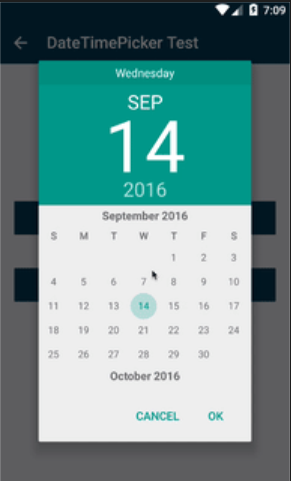
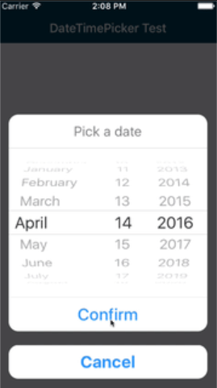

# react-native-pickdate
A simple way to pick date through native date-picker and time-picker inside a modal.

## usage
```js
import pickDate from 'react-native-pickdate';

export default class App extends Component<Props> {

    constructor(props) {
        super(props);
        this.state = {
            curSel: '未选择'
        };
    }

    createUpdate(type){
        let formatStr;
        switch (type){
            case 'date':formatStr = 'YYYY-MM-dd';break;
            case 'time':formatStr = 'hh:mm';break;
            case 'datetime':formatStr = 'YYYY-MM-dd hh:mm';break;
        }
        let self = this;
        return (date)=>{
            console.log('date',date);
            let curSel = format(date,formatStr);
            self.setState({curSel});
        }
    }

    render() {
        let {curSel} = this.state;
        return (
            <View style={styles.container}>
                <TouchableOpacity
                    onPress={()=>pickDate(this.createUpdate('date'))}>
                    <View style={styles.button}>
                        <Text>Pick date</Text>
                    </View>
                </TouchableOpacity>
                <TouchableOpacity
                    onPress={()=>pickDate(this.createUpdate('time'),pickDate.TYPE.TIME)}>
                    <View style={styles.button}>
                        <Text>Pick time</Text>
                    </View>
                </TouchableOpacity>
                <TouchableOpacity
                    onPress={()=>pickDate(this.createUpdate('datetime'),pickDate.TYPE.DATETIME)}>
                    <View style={styles.button}>
                        <Text>Pick datetime</Text>
                    </View>
                </TouchableOpacity>
                <TouchableOpacity
                    onPress={()=>pickDate({
                            onConfirm:this.createUpdate('datetime'),
                            type:pickDate.TYPE.DATETIME,
                            is24Hour:false,
                            date:new Date('2000-10-10')
                        })}>
                    <View style={styles.button}>
                        <Text>Pick datetime by options</Text>
                    </View>
                </TouchableOpacity>
                <Text style={styles.text}>{curSel}</Text>
            </View>
        );
    }
}
```

## screenshot




## Install
`npm install --save react-native-pickdate` or `yarn add react-native-pickdate`.

## Available options
|     Name    |  Type  |           Default           |                      Description                       |
|-------------|--------|-----------------------------|--------------------------------------------------------|
| cancelText  | string | 'Cancel'                    | The text on the cancel button on iOS                   |
| confirmText | string | 'Confirm'                   | The text on the confirm button on iOS                  |
| titleText   | string | 'Pick a date'/'Pick a time' | The title text on iOS                                  |
| onConfirm   | func   |                             | confirm handler                                        |
| onCancel    | func   |                             | cancel handler                                         |
| is24Hour    | bool   | true                        | If false, the picker shows an AM/PM chooser on Android |
| date        | Date   | new Date()                  | default show date                                      |
| type        | string | pickDate.TYPE.DATE          | date / time /datetime                                  |

## Thanks
[react-native-root-siblings](https://github.com/magicismight/react-native-root-siblings)

[react-native-modal-datetime-picker](https://github.com/mmazzarolo/react-native-modal-datetime-picker)
